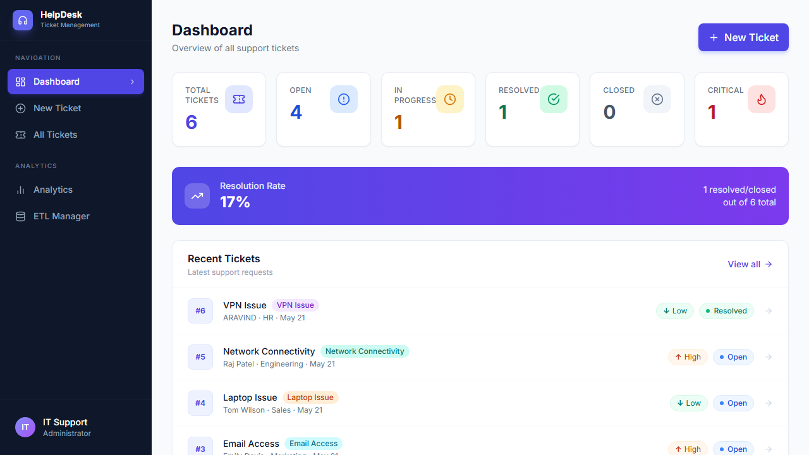
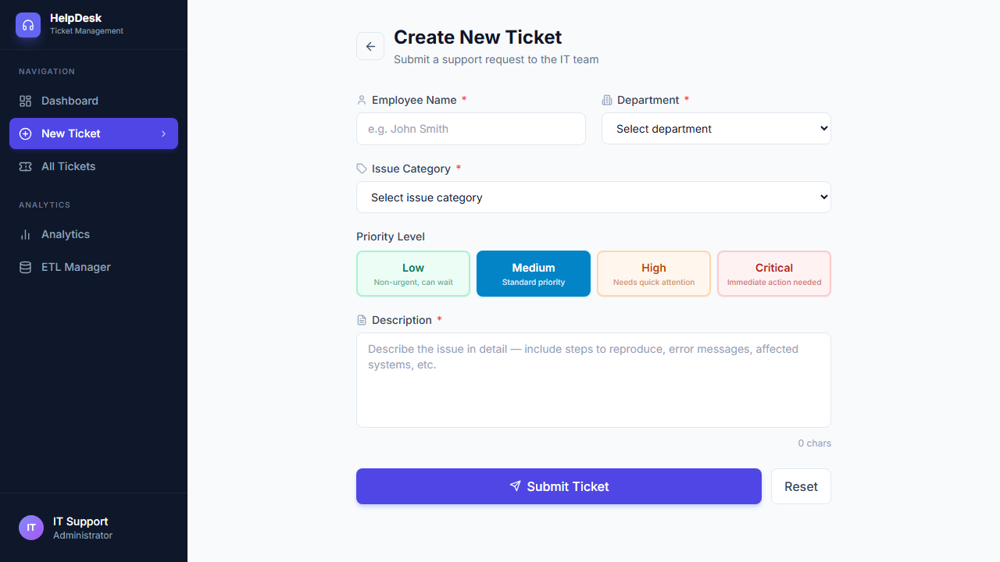
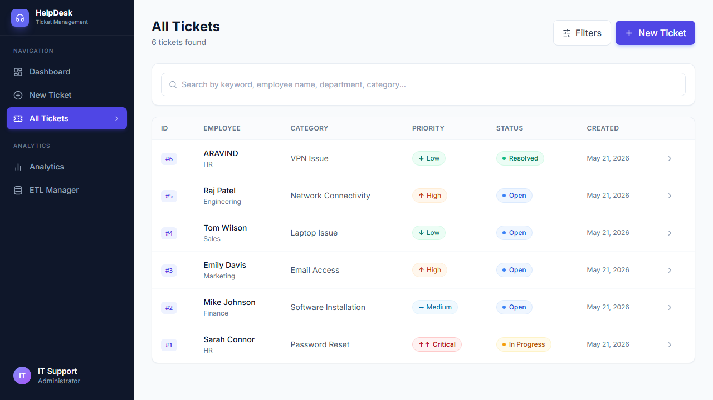
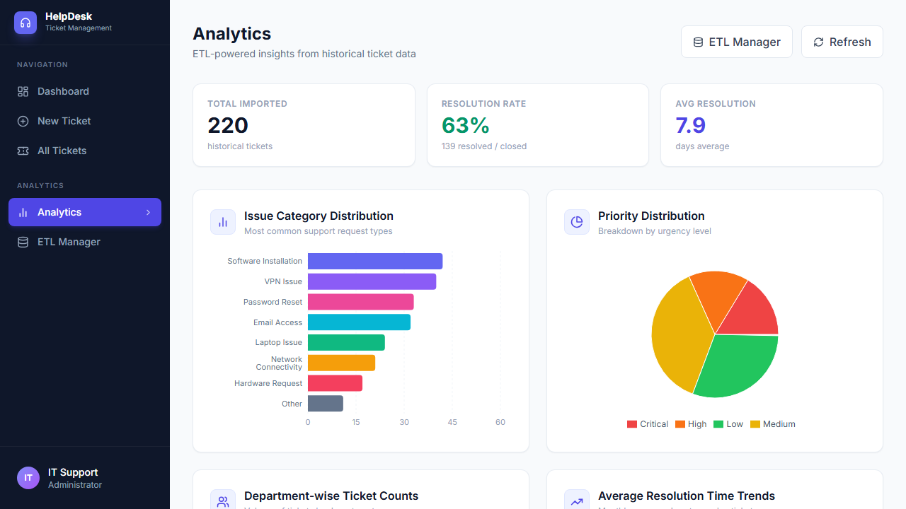
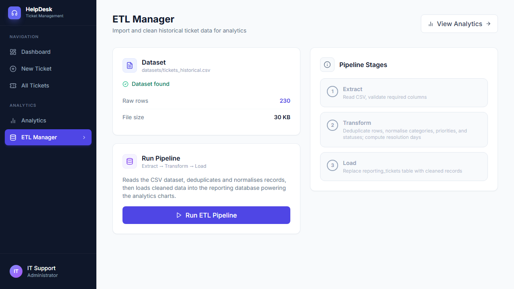

# Helpdesk Ticket Management System (HDMS)

A full-stack web application for managing IT support tickets — built with React, FastAPI, and SQLite.  
**Phase 2** extends Phase 1 with an ETL pipeline, historical data import, and an analytics dashboard.

---

## Project Overview

Organizations rely on IT support teams to resolve employee issues like VPN failures, software requests, and password resets. This system provides a centralized, web-based platform to:

- Create and track support tickets through a status workflow
- Search and filter tickets by keyword, category, status, or priority
- Import and clean historical ticket datasets via an ETL pipeline
- Visualize support metrics through charts and analytics dashboards

---

## Features

### Phase 1 — Ticket Management
- **Dashboard** — Stats overview with resolution rate and recent tickets
- **Create Ticket** — Form with employee info, category, priority, and description
- **Ticket Listing** — Filterable/searchable table of all tickets
- **Ticket Detail** — Full view with inline edit, quick status progression, resolution notes
- **CRUD Operations** — Full Create, Read, Update, Delete for tickets
- **Search & Filter** — Keyword search + category/status/priority filters

### Phase 2 — ETL & Analytics
- **ETL Pipeline** — Python/Pandas script to Extract → Transform → Load historical CSV data
- **Data Cleaning** — Deduplication, category/priority/status normalisation, date parsing
- **Analytics Dashboard** — Four charts: category distribution, priority breakdown, department counts, resolution time trends
- **ETL Manager UI** — Run the pipeline from the browser and see row-level stats
- **Analytics APIs** — Five dedicated REST endpoints backed by the cleaned reporting database

---

## Screenshots

### Dashboard — Stats Overview & Recent Tickets


### Create New Ticket — Submission Form


### All Tickets — Searchable & Filterable Listing


### Analytics — ETL-Powered Charts & Insights


### ETL Manager — Pipeline Runner & Stage Overview


---

## Technology Stack

| Layer        | Technology                    |
|--------------|-------------------------------|
| Frontend     | React 18 + Vite               |
| Styling      | Tailwind CSS                  |
| Charts       | Recharts                      |
| HTTP Client  | Axios                         |
| Routing      | React Router v6               |
| Backend      | Python FastAPI                |
| Database     | SQLite + SQLAlchemy           |
| ETL          | Python + Pandas               |
| Validation   | Pydantic v2                   |
| API Testing  | Postman / Swagger UI          |

---

## Project Structure

```
HDMS/
├── datasets/
│   ├── tickets_historical.csv    # 230-row dataset (includes intentional duplicates)
│   └── generate_dataset.py       # Script to regenerate the CSV
├── backend/
│   ├── main.py                   # FastAPI app + CORS + routes
│   ├── database.py               # SQLAlchemy engine & session
│   ├── models.py                 # ORM models (Ticket, ReportingTicket)
│   ├── schemas.py                # Pydantic schemas
│   ├── crud.py                   # Ticket CRUD operations
│   ├── analytics_crud.py         # Analytics queries on reporting table
│   ├── etl/
│   │   ├── extract.py            # Read & validate CSV
│   │   ├── transform.py          # Deduplicate, normalise, compute resolution days
│   │   ├── load.py               # Load cleaned data into reporting_tickets table
│   │   └── pipeline.py           # Orchestrator (extract → transform → load)
│   ├── routers/
│   │   ├── tickets.py            # Ticket CRUD endpoints
│   │   ├── analytics.py          # Analytics endpoints
│   │   └── etl.py                # ETL trigger endpoint
│   └── requirements.txt
├── frontend/
│   ├── src/
│   │   ├── components/           # Sidebar, StatusBadge, PriorityBadge, StatsCard
│   │   ├── pages/
│   │   │   ├── Dashboard.jsx
│   │   │   ├── CreateTicket.jsx
│   │   │   ├── TicketList.jsx
│   │   │   ├── TicketDetail.jsx
│   │   │   ├── Analytics.jsx     # Phase 2: charts dashboard
│   │   │   └── EtlManager.jsx    # Phase 2: ETL runner UI
│   │   ├── services/
│   │   │   ├── ticketService.js
│   │   │   └── analyticsService.js  # Phase 2: analytics & ETL API calls
│   │   ├── App.jsx
│   │   ├── api.js
│   │   └── index.css
│   ├── index.html
│   ├── package.json
│   ├── vite.config.js
│   └── tailwind.config.js
├── database/
│   └── schema.sql
├── screenshots/
├── docs/
└── README.md
```

---

## Setup Instructions

### Prerequisites

- Python 3.9+
- Node.js 18+
- npm

### Backend Setup

```bash
cd backend

# Create and activate virtual environment
python -m venv venv
venv\Scripts\activate          # Windows
source venv/bin/activate       # Mac/Linux

# Install dependencies (includes pandas for ETL)
pip install -r requirements.txt

# Start the server
uvicorn main:app --reload --port 8000
```

Backend: `http://localhost:8000`  
Swagger docs: `http://localhost:8000/docs`

### Frontend Setup

```bash
cd frontend
npm install
npm run dev
```

Frontend: `http://localhost:5173`

### Database

The SQLite database (`backend/helpdesk.db`) is created automatically on first run.  
To load the 5 sample tickets from the schema:

```bash
sqlite3 backend/helpdesk.db < database/schema.sql
```

---

## ETL Workflow

### 1. Dataset

The historical dataset lives in `datasets/tickets_historical.csv` (230 rows, including 10 intentional duplicates for deduplication testing). To regenerate it:

```bash
cd datasets
python generate_dataset.py
```

**Dataset columns:** `ticket_id`, `employee_name`, `department`, `issue_category`, `description`, `priority`, `status`, `created_at`, `resolved_at`

### 2. Running the Pipeline

**Option A — via the browser (recommended):**

1. Start the backend and frontend servers.
2. Navigate to **ETL Manager** in the sidebar.
3. Click **Run ETL Pipeline** — the UI shows extracted/deduped/loaded row counts.
4. Navigate to **Analytics** to see the populated charts.

**Option B — via the API:**

```bash
curl -X POST http://localhost:8000/etl/run
```

**Option C — directly in Python:**

```python
from sqlalchemy.orm import Session
from backend.database import SessionLocal
from backend.etl.pipeline import run_pipeline

db = SessionLocal()
result = run_pipeline(db)
print(result)
```

### 3. Pipeline Stages

| Stage | What it does |
|-------|-------------|
| **Extract** | Reads `tickets_historical.csv`, validates required columns |
| **Transform** | Drops duplicate rows; normalises category, priority, status values; parses timestamps; computes `resolution_days` for closed tickets |
| **Load** | Replaces the `reporting_tickets` table with the cleaned records |

---

## API Documentation

Base URL: `http://localhost:8000`

### Ticket Endpoints (Phase 1)

| Method | Endpoint            | Description           |
|--------|---------------------|-----------------------|
| GET    | `/tickets/`         | Get all tickets       |
| GET    | `/tickets/stats`    | Get ticket statistics |
| GET    | `/tickets/{id}`     | Get ticket by ID      |
| POST   | `/tickets/`         | Create new ticket     |
| PUT    | `/tickets/{id}`     | Update ticket         |
| DELETE | `/tickets/{id}`     | Delete ticket         |
| GET    | `/search`           | Search/filter tickets |

### Analytics Endpoints (Phase 2)

| Method | Endpoint                          | Description                          |
|--------|-----------------------------------|--------------------------------------|
| GET    | `/analytics/summary`              | Total imported, resolution rate, avg days |
| GET    | `/analytics/category-distribution`| Ticket count per issue category      |
| GET    | `/analytics/priority-distribution`| Ticket count per priority level      |
| GET    | `/analytics/department-counts`    | Ticket count per department          |
| GET    | `/analytics/resolution-trends`    | Avg resolution days by month         |

### ETL Endpoints (Phase 2)

| Method | Endpoint            | Description                            |
|--------|---------------------|----------------------------------------|
| GET    | `/etl/dataset-info` | Check dataset file existence and size  |
| POST   | `/etl/run`          | Run the full ETL pipeline              |

---

## Ticket Categories

- VPN Issue
- Password Reset
- Software Installation
- Laptop Issue
- Email Access
- Network Connectivity
- Hardware Request
- Other

## Priority Levels

| Priority | Description           |
|----------|-----------------------|
| Low      | Non-urgent            |
| Medium   | Standard priority     |
| High     | Needs quick attention |
| Critical | Immediate action      |

## Status Workflow

`Open` → `In Progress` → `Resolved` → `Closed`

---

## Evaluation Criteria Coverage

| Criteria                     | Coverage |
|------------------------------|----------|
| Frontend Development         | React + Tailwind + Recharts, 6 pages, reusable components |
| Backend API Development      | FastAPI, 14 endpoints, REST standards |
| Database Integration         | SQLite + SQLAlchemy ORM (tickets + reporting tables) |
| CRUD Functionality           | Full Create/Read/Update/Delete for tickets |
| ETL Implementation           | Python/Pandas Extract → Transform → Load pipeline |
| Analytics APIs               | 5 endpoints: category, priority, department, trends, summary |
| Dashboard UI                 | Bar, pie, and line charts via Recharts |
| Cleaned Reporting Database   | Separate `reporting_tickets` table populated by ETL |
| Dataset                      | 230-row CSV in `datasets/` folder |
| Search/Filtering             | Keyword + category + status + priority |
| Code Quality & Structure     | Modular, layered architecture |
| Documentation                | README + API docs + ETL workflow |
