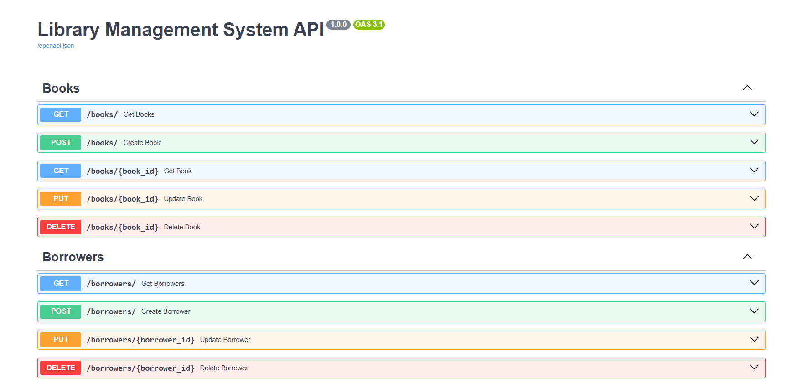
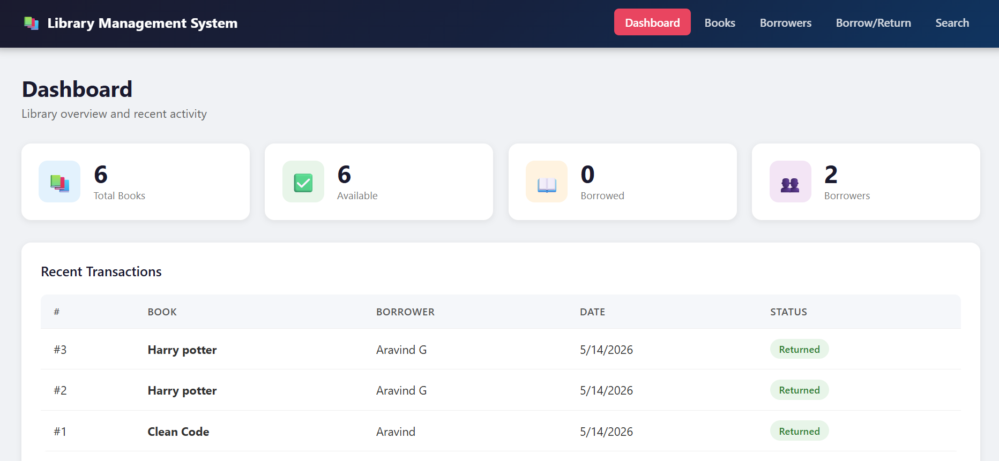
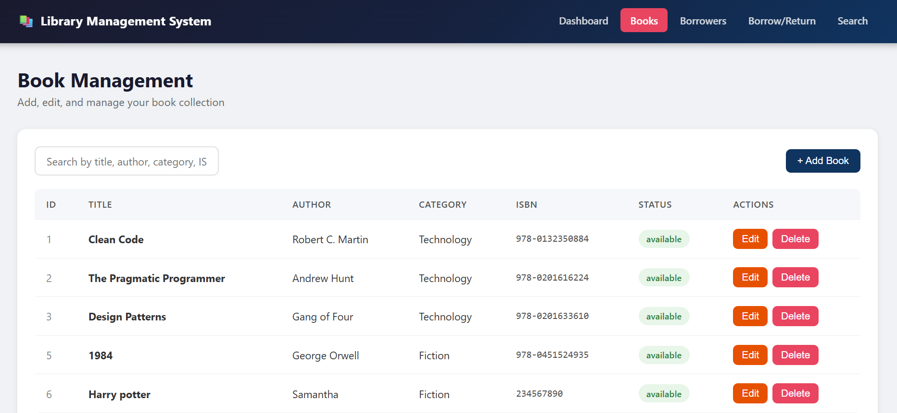
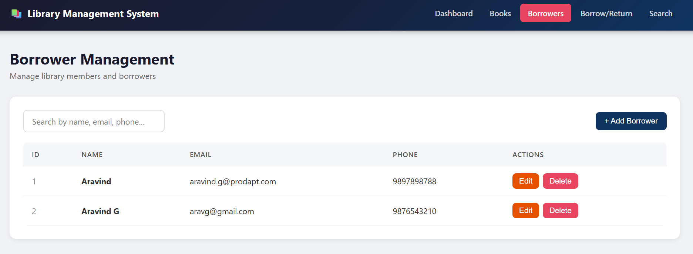
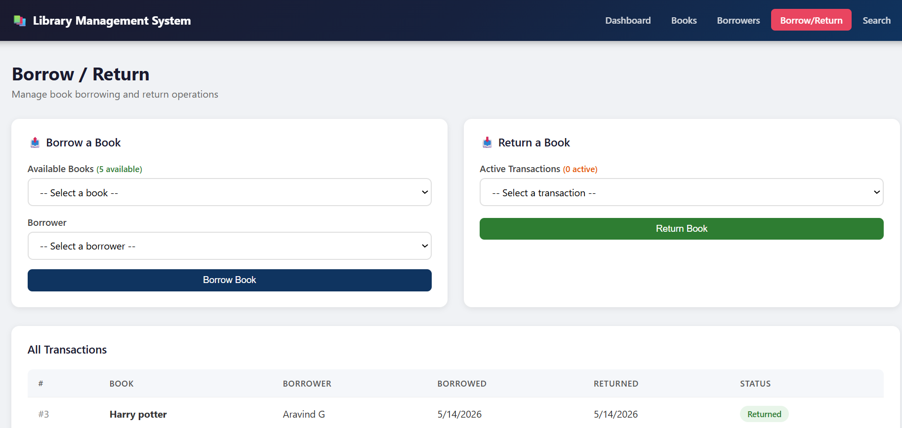
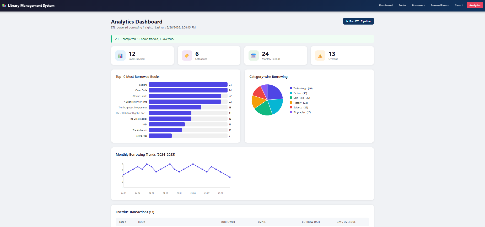
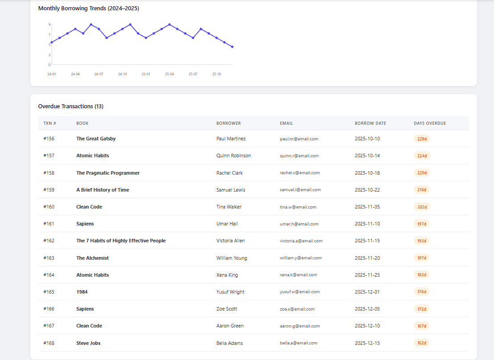

# Library Management System (LMS)

A full-stack Library Management System capstone project built as part of the AFDE May 2026 program.

## Overview

This application provides a complete library management solution with features for managing books, borrowers, and borrow/return transactions through a modern web interface. **Phase 2** extends the system with an ETL pipeline for transaction analytics and book usage reporting.

## Tech Stack

| Layer        | Technology              | Version  |
|--------------|-------------------------|----------|
| Frontend     | React (Vite)            | 18.x     |
| Routing      | React Router DOM        | 6.x      |
| HTTP Client  | Axios                   | 1.x      |
| Backend      | Python FastAPI          | 0.115.0  |
| ORM          | SQLAlchemy              | 2.0.36   |
| Validation   | Pydantic                | 2.9.2    |
| Server       | Uvicorn                 | 0.32.0   |
| Database     | SQLite                  | Built-in |
| ETL          | Pandas                  | 2.2.3    |

## Features

### Phase 1 – Core LMS
- **Dashboard** – Live stats: total books, available, borrowed, borrowers, recent transactions
- **Book Management** – Add, edit, delete books with availability tracking
- **Borrower Management** – Register, update, delete library members
- **Borrow/Return** – Issue books and process returns; active transaction tracking
- **Advanced Search** – Search books by keyword, category, or author
- **REST API** – Full CRUD API with FastAPI and auto-generated Swagger docs at `/docs`

### Phase 2 – ETL Pipeline & Analytics
- **ETL Pipeline** – Python + Pandas pipeline with Extract, Transform, Load stages
  - Extract from CSV datasets (books, borrowers, transactions)
  - Transform: handle missing values, remove duplicates, validate references
  - Load: compute and store aggregated analytics in dedicated reporting tables
- **Analytics Dashboard** – Visual reports generated from ETL output:
  - Most borrowed books (bar chart)
  - Category-wise borrowing distribution (pie chart)
  - Monthly borrowing trends (line chart)
  - Overdue transaction analysis (table)
- **Analytics API** – RESTful endpoints serving all analytics data
- **On-demand ETL** – Trigger ETL pipeline from the UI with a single click

## Screenshots

### Library Overview


### Dashboard


### Book Management


### Borrower Management


### Borrow / Return


### ETL Dashboard


### ETL Dashboard 2


## Project Structure

```
AFDE_May26_aravind_LMS/
├── backend/
│   ├── main.py              # FastAPI app entry point
│   ├── database.py          # SQLAlchemy engine and session
│   ├── models.py            # ORM models (Book, Borrower, Transaction, Analytics*)
│   ├── schemas.py           # Pydantic request/response schemas
│   ├── crud.py              # Database CRUD operations
│   ├── requirements.txt     # Python dependencies (includes pandas)
│   ├── etl/
│   │   ├── extract.py       # Stage 1: Read CSV datasets into DataFrames
│   │   ├── transform.py     # Stage 2: Clean data, compute aggregations
│   │   ├── load.py          # Stage 3: Write analytics results to SQLite
│   │   └── etl_pipeline.py  # Orchestrator – run standalone or via API
│   └── routers/
│       ├── __init__.py
│       ├── books.py         # Book CRUD endpoints
│       ├── borrowers.py     # Borrower CRUD endpoints
│       ├── transactions.py  # Borrow/Return endpoints
│       └── analytics.py     # Analytics & ETL trigger endpoints
├── frontend/
│   ├── index.html
│   ├── package.json
│   ├── vite.config.js
│   └── src/
│       ├── main.jsx
│       ├── App.jsx
│       ├── App.css
│       ├── index.css
│       ├── services/
│       │   └── api.js       # Axios API service layer (incl. analyticsAPI)
│       └── pages/
│           ├── Dashboard.jsx
│           ├── Books.jsx
│           ├── Borrowers.jsx
│           ├── BorrowReturn.jsx
│           ├── Search.jsx
│           └── Analytics.jsx  # Phase 2 analytics dashboard
├── datasets/                  # Phase 2 input data
│   ├── books.csv              # 50 book records
│   ├── borrowers.csv          # 30 borrower records
│   └── transactions.csv       # 168 transaction records
├── database/
│   └── schema.sql             # SQLite schema + sample data
├── docs/
├── screenshots/
├── .gitignore
└── README.md
```

## Setup & Running

### Backend

1. Navigate to the backend directory:
   ```bash
   cd backend
   ```

2. Create and activate a virtual environment:
   ```bash
   python -m venv venv
   # Windows
   venv\Scripts\activate
   # macOS/Linux
   source venv/bin/activate
   ```

3. Install dependencies:
   ```bash
   pip install -r requirements.txt
   ```

4. Start the FastAPI server:
   ```bash
   uvicorn main:app --reload --port 8000
   ```

5. API will be available at: `http://localhost:8000`
   - Swagger UI docs: `http://localhost:8000/docs`
   - ReDoc: `http://localhost:8000/redoc`

### Frontend

1. Navigate to the frontend directory:
   ```bash
   cd frontend
   ```

2. Install Node.js dependencies:
   ```bash
   npm install
   ```

3. Start the development server:
   ```bash
   npm run dev
   ```

4. App will be available at: `http://localhost:5173`

### Running the ETL Pipeline

**Option A – Via the UI:**  
Navigate to the **Analytics** page and click **Run ETL Pipeline**.

**Option B – Via the API:**  
```bash
POST http://localhost:8000/analytics/run-etl
```

**Option C – Standalone script:**
```bash
cd backend
python etl/etl_pipeline.py
```

## ETL Workflow

```
datasets/books.csv          ─┐
datasets/borrowers.csv       ├─► [EXTRACT] ─► raw DataFrames
datasets/transactions.csv   ─┘

raw DataFrames ─► [TRANSFORM]
  - Drop rows with missing required fields
  - Remove duplicate records (by isbn / email / transaction_id)
  - Validate foreign key references (book_id, borrower_id)
  - Parse date columns
  - Compute is_overdue flag (no return + borrow_date > 30 days ago)
  - Aggregate: most_borrowed, category_borrowing, monthly_trends, overdue

aggregated DataFrames ─► [LOAD]
  - Truncate analytics tables (idempotent)
  - Insert: analytics_most_borrowed
  - Insert: analytics_category_borrowing
  - Insert: analytics_monthly_trends
  - Insert: analytics_overdue
```

## API Endpoints

### Core (Phase 1)
| Method | Endpoint              | Description                        |
|--------|-----------------------|------------------------------------|
| GET    | `/`                   | API health check                   |
| GET    | `/dashboard`          | Dashboard statistics               |
| GET    | `/search`             | Search books (q, category, author) |
| GET    | `/books/`             | List all books                     |
| POST   | `/books/`             | Add a new book                     |
| GET    | `/books/{id}`         | Get book by ID                     |
| PUT    | `/books/{id}`         | Update book                        |
| DELETE | `/books/{id}`         | Delete book                        |
| GET    | `/borrowers/`         | List all borrowers                 |
| POST   | `/borrowers/`         | Register a new borrower            |
| PUT    | `/borrowers/{id}`     | Update borrower                    |
| DELETE | `/borrowers/{id}`     | Delete borrower                    |
| GET    | `/transactions`       | List all transactions              |
| POST   | `/borrow`             | Borrow a book                      |
| POST   | `/return`             | Return a book                      |

### Analytics (Phase 2)
| Method | Endpoint                       | Description                              |
|--------|--------------------------------|------------------------------------------|
| GET    | `/analytics/status`            | ETL run status and record counts         |
| GET    | `/analytics/most-borrowed`     | Top borrowed books (limit param)         |
| GET    | `/analytics/category-borrowing`| Category-wise borrow counts              |
| GET    | `/analytics/monthly-trends`    | Monthly borrowing trend data             |
| GET    | `/analytics/overdue`           | Overdue transactions                     |
| POST   | `/analytics/run-etl`           | Trigger full ETL pipeline                |

## Database Schema

The SQLite database (`library.db`) is auto-created on backend startup via SQLAlchemy.

### Phase 1 Tables
- **books** – book_id, title, author, category, isbn, availability_status
- **borrowers** – borrower_id, borrower_name, email, phone
- **transactions** – transaction_id, book_id, borrower_id, borrow_date, return_date

### Phase 2 Analytics Tables (populated by ETL)
- **analytics_most_borrowed** – book_title, author, category, isbn, borrow_count, etl_run_at
- **analytics_category_borrowing** – category, borrow_count, etl_run_at
- **analytics_monthly_trends** – year_month, borrow_count, etl_run_at
- **analytics_overdue** – transaction_id, book_title, borrower_name, borrower_email, borrow_date, days_overdue, etl_run_at

## Datasets

Located in `datasets/`:

| File               | Records | Description                              |
|--------------------|---------|------------------------------------------|
| books.csv          | 50      | Books across 8 categories                |
| borrowers.csv      | 30      | Library members                          |
| transactions.csv   | 168     | Borrow/return history (Jan 2024–Dec 2025)|
